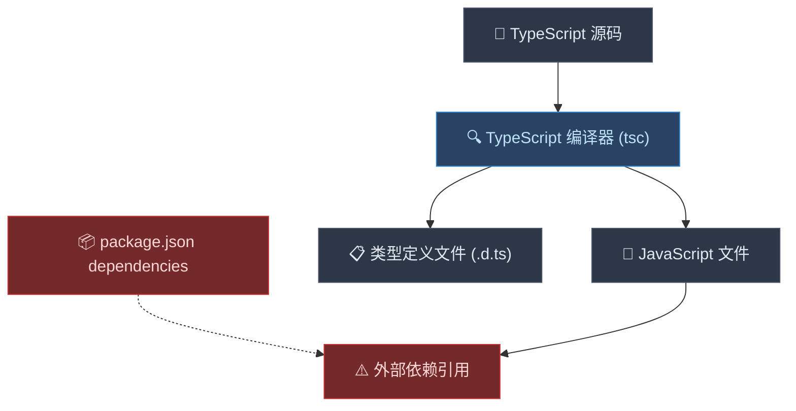
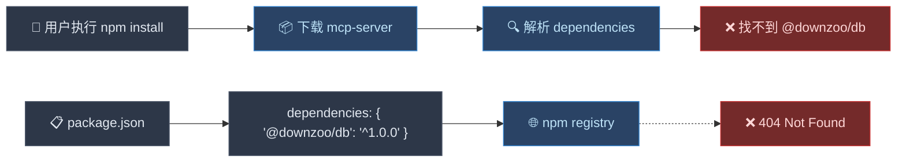

# 为什么 esbuild 能解决 DB 打包问题？

## 问题的本质

在 monorepo 中，你遇到的问题本质上是 **编译器（Compiler）** 和 **打包器（Bundler）** 的职责差异导致的。

## 引入 esbuild 前的状态

### TypeScript 编译器的工作原理



### 编译前后的代码对比

**编译前 (TypeScript):**
```typescript
// packages/mcp-server/src/index.ts
import { PrismaClient } from '@downzoo/db';
import { Server } from '@modelcontextprotocol/sdk/server/index.js';

const prisma = new PrismaClient();
const server = new Server(/* ... */);
```

**编译后 (JavaScript):**
```javascript
// packages/mcp-server/build/index.js
import { PrismaClient } from '@downzoo/db';  // ❌ 仍然是外部依赖！
import { Server } from '@modelcontextprotocol/sdk/server/index.js';

const prisma = new PrismaClient();
const server = new Server(/* ... */);
```

### 发布到 npm 后的问题



## 引入 esbuild 后的状态

### esbuild 打包器的工作原理

```mermaid
flowchart TD
    A["📝 TypeScript 源码"] --> B["🎯 esbuild 打包器"]
    C["📦 @downzoo/db 源码"] --> B
    D["📦 @prisma/client"] --> B
    
    B