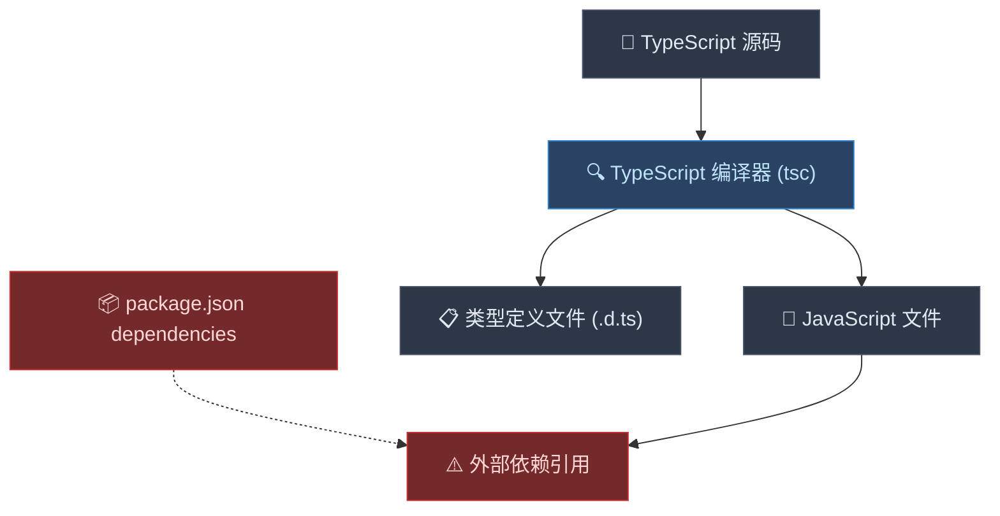
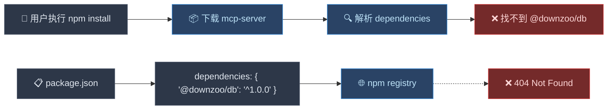
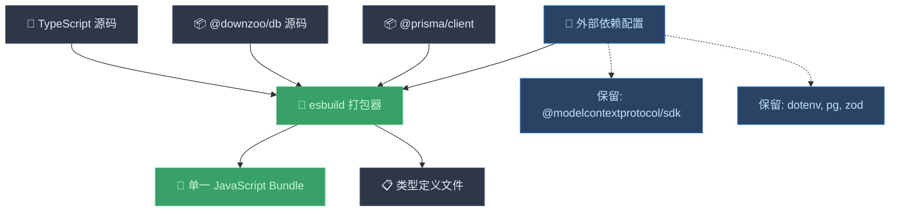
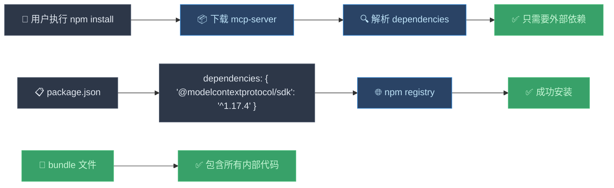
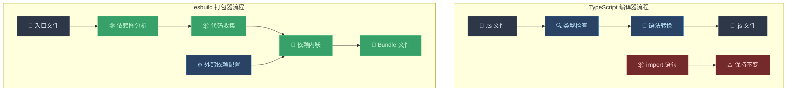
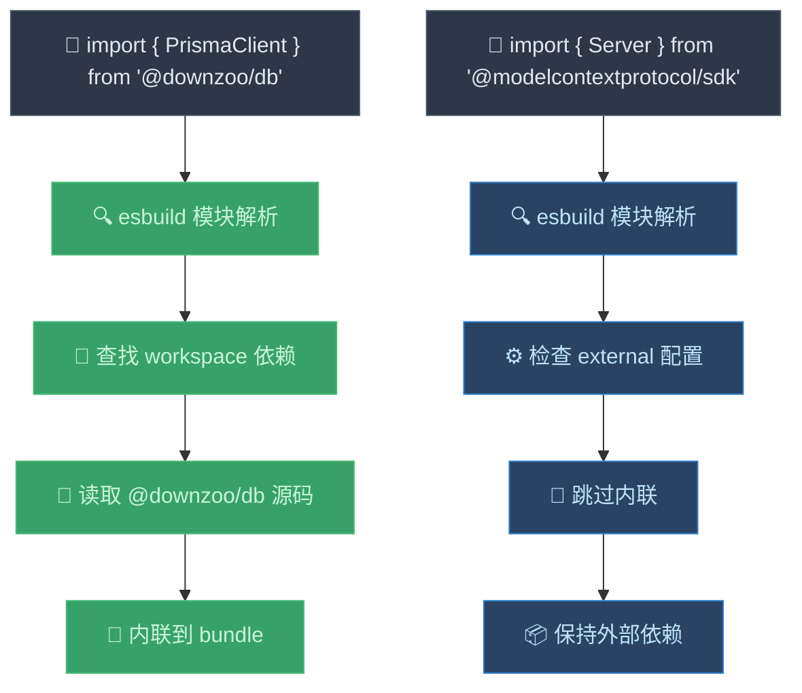

# 为什么 esbuild 能解决 DB 打包问题？

## 问题的本质

在 monorepo 中，你遇到的问题本质上是 **编译器（Compiler）** 和 **打包器（Bundler）** 的职责差异导致的。

## 引入 esbuild 前的状态

### TypeScript 编译器的工作原理



### 编译前后的代码对比

**编译前 (TypeScript):**
```typescript
// packages/mcp-server/src/index.ts
import { PrismaClient } from '@downzoo/db';
import { Server } from '@modelcontextprotocol/sdk/server/index.js';

const prisma = new PrismaClient();
const server = new Server(/* ... */);
```

**编译后 (JavaScript):**
```javascript
// packages/mcp-server/build/index.js
import { PrismaClient } from '@downzoo/db';  // ❌ 仍然是外部依赖！
import { Server } from '@modelcontextprotocol/sdk/server/index.js';

const prisma = new PrismaClient();
const server = new Server(/* ... */);
```

### 发布到 npm 后的问题



## 引入 esbuild 后的状态

### esbuild 打包器的工作原理



### 打包前后的代码对比

**打包前 (TypeScript):**
```typescript
// packages/mcp-server/src/index.ts
import { PrismaClient } from '@downzoo/db';
import { Server } from '@modelcontextprotocol/sdk/server/index.js';

const prisma = new PrismaClient();
const server = new Server(/* ... */);
```

**打包后 (JavaScript Bundle):**
```javascript
// packages/mcp-server/build/index.js
#!/usr/bin/env node

// ✅ @downzoo/db 的代码被内联到这里
class PrismaClient {
  constructor() {
    // ... Prisma 客户端的完整实现
  }
  // ... 所有方法都被包含进来
}

// ✅ 外部依赖保持引用
import { Server } from '@modelcontextprotocol/sdk/server/index.js';

const prisma = new PrismaClient();
const server = new Server(/* ... */);
```

### 发布到 npm 后的效果



## 编译器 vs 打包器的本质区别

### 对比表格

| 特性 | TypeScript 编译器 (tsc) | esbuild 打包器 |
|------|-------------------------|----------------|
| **主要职责** | 类型检查 + 语法转换 | 依赖解析 + 代码打包 |
| **输入** | TypeScript 文件 | 入口文件 + 依赖图 |
| **输出** | 对应的 JavaScript 文件 | 单一或多个 Bundle 文件 |
| **依赖处理** | 保持 import/require 语句 | 内联依赖代码 |
| **文件结构** | 保持原有目录结构 | 生成扁平化 Bundle |
| **外部依赖** | 不处理，保持引用 | 可选择性内联或保持外部 |

### 工作流程对比



## 为什么 esbuild 能解决问题？

### 1. 依赖内联机制

esbuild 通过 **静态分析** 和 **代码内联** 解决了依赖问题：

```javascript
// esbuild 配置
const external = [
  '@modelcontextprotocol/sdk',  // 保持外部
  'dotenv',
  'pg',
  'zod'
];

// @downzoo/db 和 @prisma/client 不在 external 列表中
// 因此会被内联到 bundle 中
```

### 2. 模块解析策略



### 3. 构建产物对比

**使用 TypeScript 编译器:**
```
packages/mcp-server/build/
├── index.js          // 仍然包含 import '@downzoo/db'
├── index.d.ts        // 类型定义
└── package.json      // dependencies 包含 @downzoo/db
```

**使用 esbuild 打包器:**
```
packages/mcp-server/build/
├── index.js          // 包含内联的 @downzoo/db 代码
├── index.d.ts        // 类型定义
└── package.json      // dependencies 不包含 @downzoo/db
```

## 实际的代码变化

### package.json 依赖变化

**引入 esbuild 前:**
```json
{
  "dependencies": {
    "@modelcontextprotocol/sdk": "^1.17.4",
    "@downzoo/db": "^1.0.0",           // ❌ 用户安装时找不到
    "@prisma/client": "^6.15.0",
    "dotenv": "^17.2.2",
    "pg": "^8.16.3",
    "zod": "3"
  }
}
```

**引入 esbuild 后:**
```json
{
  "dependencies": {
    "@modelcontextprotocol/sdk": "^1.17.4",
    // ✅ @downzoo/db 被移除，代码已内联
    "dotenv": "^17.2.2",
    "pg": "^8.16.3",
    "zod": "3"
  },
  "devDependencies": {
    "@downzoo/db": "workspace:*",      // 开发时使用
    "@prisma/client": "^6.15.0",       // 开发时使用
    "esbuild": "^0.19.0"
  }
}
```

## 总结

### 问题的根本原因
1. **TypeScript 编译器** 只负责类型检查和语法转换，不处理依赖打包
2. **monorepo 内部依赖** 无法发布到公共 npm registry
3. **用户安装时** 无法找到私有的 `@downzoo/db` 包

### esbuild 的解决方案
1. **静态分析依赖图**，识别所有需要的模块
2. **选择性内联代码**，将内部依赖打包进 bundle
3. **保持外部依赖**，维持对公共包的引用
4. **生成自包含的产物**，用户安装时无需额外依赖

### 核心优势
- ✅ **开发体验不变**：在 monorepo 中继续使用 workspace 依赖
- ✅ **部署简化**：发布的包自包含，无私有依赖
- ✅ **用户友好**：安装即用，无需额外配置
- ✅ **代码复用**：避免重复维护相同代码

这就是为什么引入 esbuild 能够完美解决 monorepo 中的依赖打包问题！