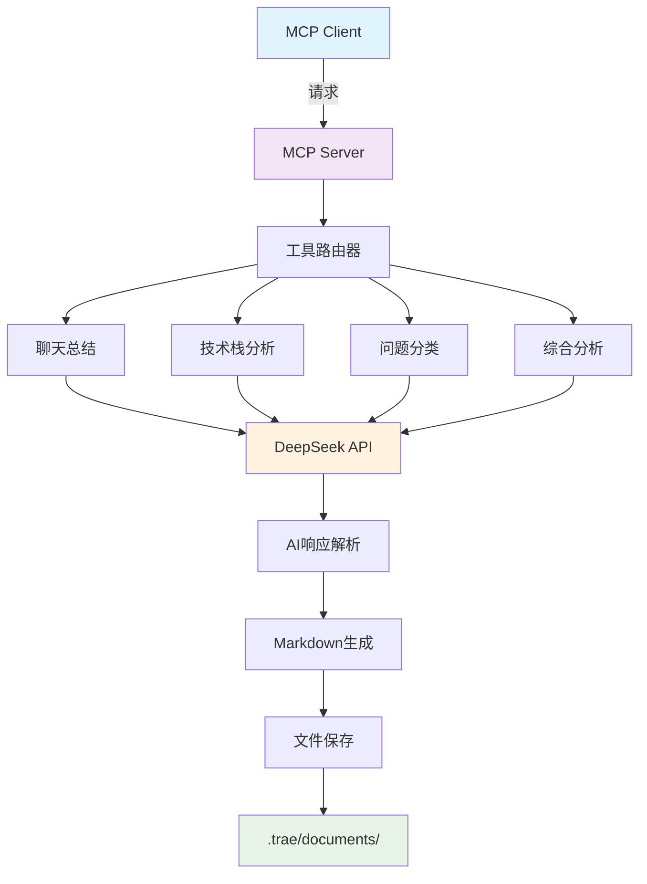
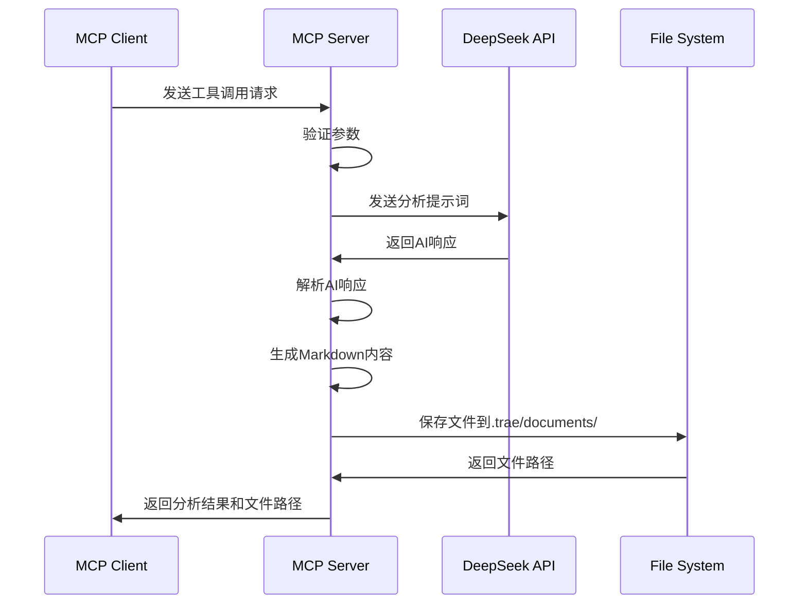

# AI协作档案分析器 MCP 服务器文档

## 📋 项目概述

这是一个基于 Model Context Protocol (MCP) 的智能分析服务器，专门用于分析聊天内容、识别技术栈和分类问题。该服务器集成了 DeepSeek AI API，提供强大的自然语言处理能力。

## 🏗️ 核心架构



## 🛠️ 主要功能模块

### 1. 服务器核心 (Server Core)
- **MCP 服务器实例**: 基于 `@modelcontextprotocol/sdk` 构建
- **服务器名称**: `ai-collaboration-analyzer`
- **版本**: `2.0.0`
- **传输协议**: StdioServerTransport

### 2. AI 集成 (AI Integration)
- **API 提供商**: DeepSeek
- **模型**: `deepseek-chat`
- **配置参数**:
  - Temperature: 0.7
  - Max Tokens: 2000
- **错误处理**: 完整的异常捕获和错误信息返回

### 3. 数据类型系统 (Type System)

#### 技术栈枚举 (TechStack)
```typescript
enum TechStack {
  FRONTEND, BACKEND, MOBILE, DEVOPS, DATABASE,
  AI_ML, BLOCKCHAIN, GAME_DEV, EMBEDDED, TESTING,
  DESIGN, OTHER
}
```

#### 问题分类枚举 (ProblemCategory)
```typescript
enum ProblemCategory {
  BUG_FIX, FEATURE_REQUEST, PERFORMANCE, SECURITY,
  ARCHITECTURE, CODE_REVIEW, DEPLOYMENT, LEARNING,
  TROUBLESHOOTING, OPTIMIZATION, INTEGRATION, OTHER
}
```

#### 核心接口
- `TechStackAnalysis`: 技术栈分析结果
- `ProblemClassification`: 问题分类结果
- `ChatSummaryResult`: 聊天总结结果

## 🔧 工具集 (Tools)

### 1. chat_summary
**功能**: 分析聊天内容并生成结构化总结

**输入参数**:
- `chatContent` (必需): 需要分析的聊天内容
- `filename` (可选): 输出文件名

**输出内容**:
- 关注领域列表
- AI对话思考要点
- 解决的问题列表
- 完整的 Markdown 报告

### 2. analyze_tech_stack
**功能**: 识别和分析内容中的技术栈

**分析维度**:
- 主要技术栈类型
- 次要技术栈
- 具体技术列表
- 框架识别
- 工具识别
- 置信度评估

### 3. classify_problems
**功能**: 对问题进行智能分类和评估

**分类维度**:
- 问题类别 (12种类型)
- 严重程度 (low/medium/high/critical)
- 复杂度 (simple/moderate/complex/expert)
- 预估解决时间
- 相关标签

### 4. comprehensive_analysis
**功能**: 综合分析工具，并行执行所有分析功能

**特点**:
- 并行处理提高效率
- 容错机制确保稳定性
- 生成完整的综合报告

## 📁 文件管理系统

### 保存路径
- **目标目录**: `.trae/documents/`
- **自动创建**: 递归创建目录结构
- **文件命名**: 支持自定义文件名或时间戳命名

### Markdown 生成
- **技术栈报告**: 包含技术详情、置信度、分析推理
- **问题分类报告**: 包含严重程度图标、复杂度星级
- **综合报告**: 整合所有分析结果的完整文档

## 🔄 工作流程



## 🛡️ 错误处理机制

### API 调用错误
- HTTP 状态码检查
- 网络异常处理
- 响应格式验证

### 数据解析错误
- JSON 解析容错
- 正则表达式匹配
- 默认值回退机制

### 文件操作错误
- 目录创建失败处理
- 文件写入权限检查
- 路径解析异常处理

## 🚀 启动和生命周期

### 启动流程
1. 创建 MCP 服务器实例
2. 注册工具处理器
3. 建立 Stdio 传输连接
4. 监听客户端请求

### 信号处理
- `SIGINT`: 优雅关闭服务器
- 进程退出: 清理资源和连接

## 📊 性能特性

### 并行处理
- `comprehensive_analysis` 工具使用 `Promise.allSettled` 并行执行
- 容错设计确保部分失败不影响整体结果

### 内存优化
- 流式处理大文本内容
- 及时释放 AI API 响应数据
- 文件写入使用异步 I/O

## 🔧 配置和扩展

### API 配置
- DeepSeek API Key 可配置
- API URL 支持自定义
- 请求参数可调整

### 扩展点
- 新增技术栈类型
- 添加问题分类维度
- 自定义 Markdown 模板
- 支持其他 AI 提供商

## 📈 使用场景

1. **开发团队协作**: 分析技术讨论，识别关键决策点
2. **代码审查**: 分类和优先级排序发现的问题
3. **技术栈评估**: 自动识别项目使用的技术和工具
4. **知识管理**: 将对话内容转化为结构化文档
5. **项目规划**: 基于问题分类制定开发计划

## 🎯 核心价值

- **智能化**: 利用 AI 自动提取和分析信息
- **结构化**: 将非结构化对话转为结构化数据
- **可扩展**: 模块化设计支持功能扩展
- **标准化**: 基于 MCP 协议确保兼容性
- **实用性**: 直接生成可用的文档和报告

---

**文档生成时间**: 2024年12月
**服务器版本**: 2.0.0
**维护状态**: 活跃开发中