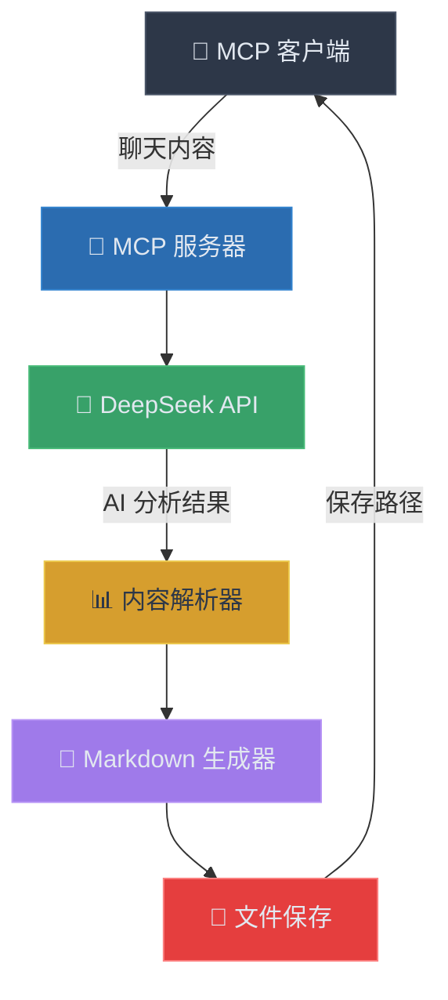

# MCP 聊天内容总结服务器

## 概述

这是一个基于 Model Context Protocol (MCP) 的服务器，专门用于分析和提炼聊天内容。它使用 DeepSeek API 来智能分析对话内容，并生成结构化的 markdown 总结报告。

## 功能特性

- 🤖 **智能分析**: 使用 DeepSeek AI 模型分析聊天内容
- 📊 **结构化提炼**: 自动提取关注领域、思考要点和解决的问题
- 📝 **Markdown 输出**: 生成格式化的 markdown 报告
- 💾 **自动保存**: 将分析结果保存为本地文件
- 🔧 **MCP 兼容**: 完全兼容 MCP 协议，可与支持 MCP 的客户端集成

## 架构设计



## 工具接口

### chat_summary

**描述**: 分析聊天内容并生成包含关注领域、思考和解决问题的 markdown 总结

**输入参数**:
- `chatContent` (必需): 需要分析的聊天内容
- `filename` (可选): 输出文件名（不包含扩展名）

**输出**: 
- 结构化的分析结果摘要
- 保存的 markdown 文件路径

## 使用方法

### 1. 构建项目

```bash
pnpm run build
```

### 2. 启动服务器

```bash
node build/index.js
```

### 3. 在 MCP 客户端中使用

调用 `chat_summary` 工具，传入聊天内容：

```json
{
  "name": "chat_summary",
  "arguments": {
    "chatContent": "这里是需要分析的聊天内容...",
    "filename": "my-chat-summary"
  }
}
```

## 输出格式

生成的 markdown 文件包含以下结构：

```markdown
# 聊天内容总结

**生成时间**: 2024-01-01 12:00:00

## 关注的领域

- 领域1
- 领域2
- ...

## AI对话中的思考

- 思考点1
- 思考点2
- ...

## 解决了的问题

- 问题1
- 问题2
- ...

---

## 原始聊天内容

```
原始聊天内容...
```
```

## 配置说明

### DeepSeek API 配置

- **API Key**: `sk-6dea10bd0c894324b9773f7e91a520c1`
- **API URL**: `https://api.deepseek.com/v1/chat/completions`
- **模型**: `deepseek-chat`
- **温度**: `0.7`
- **最大令牌数**: `2000`

### 文件保存

- 默认保存位置: 当前工作目录
- 文件命名格式: `chat-summary-{timestamp}.md`
- 编码格式: UTF-8

## 错误处理

服务器包含完善的错误处理机制：

- **API 调用失败**: 返回详细的错误信息
- **内容解析错误**: 提供解析失败的具体原因
- **文件保存失败**: 显示文件系统相关错误
- **输入验证**: 检查聊天内容是否为空

## 技术栈

- **运行时**: Node.js 20+
- **语言**: TypeScript
- **框架**: MCP SDK
- **AI 服务**: DeepSeek API
- **文件系统**: Node.js fs/promises
- **类型验证**: Zod

## 开发说明

### 项目结构

```
first-mcp/
├── src/
│   └── index.ts          # 主服务器文件
├── build/                 # 编译输出目录
├── package.json          # 项目配置
├── tsconfig.json         # TypeScript 配置
└── .trae/
    └── documents/        # 文档目录
```

### 核心组件

1. **MCP 服务器**: 处理客户端请求和工具调用
2. **DeepSeek API 客户端**: 与 AI 服务通信
3. **内容解析器**: 解析 AI 返回的结构化内容
4. **Markdown 生成器**: 创建格式化的输出文件
5. **文件管理器**: 处理文件保存和路径管理

### 扩展建议

- 支持更多 AI 模型（OpenAI、Claude 等）
- 添加自定义提示词模板
- 实现批量处理功能
- 添加输出格式选项（JSON、HTML 等）
- 集成数据库存储历史记录

## 许可证

ISC License
