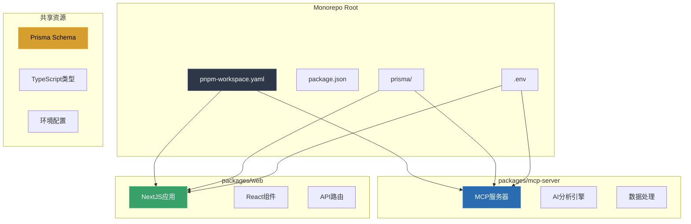
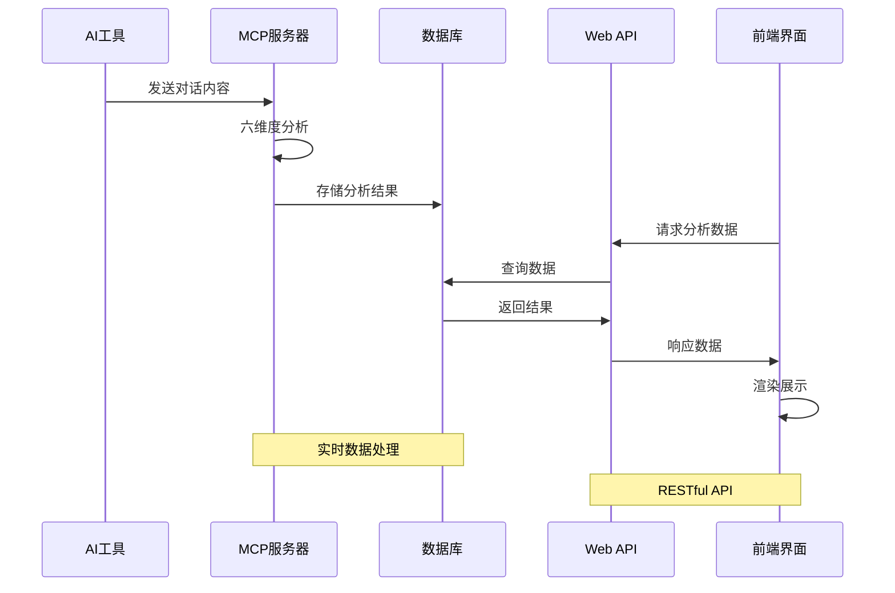
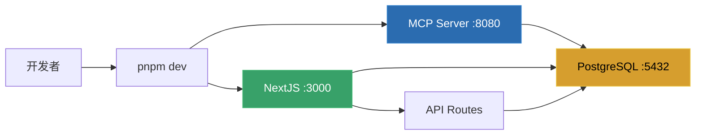
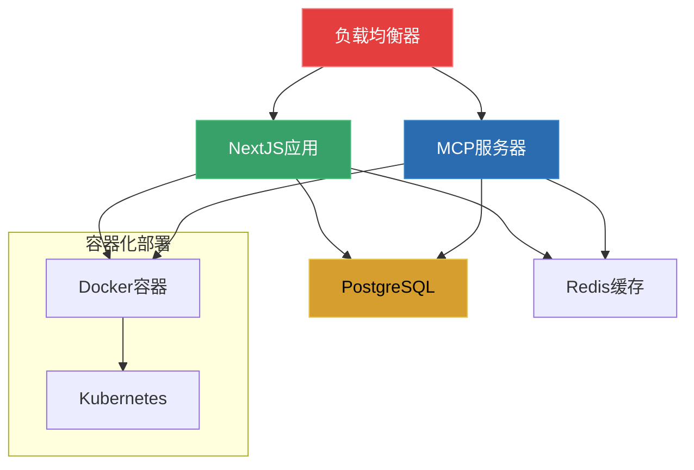

# AI协作档案分析器 - Monorepo架构设计文档

## 📋 架构概览

本项目采用pnpm monorepo架构，将AI协作档案分析器重构为包含MCP服务器和NextJS前端的完整解决方案。



## 🏗️ 目录结构

```
ai-collaboration-archive/
├── packages/
│   ├── mcp-server/                 # MCP服务器包
│   │   ├── src/
│   │   │   ├── index.ts           # MCP服务器入口
│   │   │   ├── analyzers.ts       # 六维度分析器
│   │   │   ├── ai-service.ts      # AI服务抽象层
│   │   │   ├── config.ts          # 配置管理
│   │   │   ├── database.ts        # 数据库操作
│   │   │   └── types.ts           # 类型定义
│   │   ├── build/                 # 编译输出
│   │   ├── package.json           # MCP包配置
│   │   ├── tsconfig.json          # TypeScript配置
│   │   └── mcp-config.json        # MCP特定配置
│   │
│   └── web/                       # NextJS前端包
│       ├── src/
│       │   ├── app/               # App Router
│       │   │   ├── api/           # API路由
│       │   │   ├── globals.css    # 全局样式
│       │   │   ├── layout.tsx     # 根布局
│       │   │   └── page.tsx       # 主页
│       │   ├── components/        # React组件
│       │   │   ├── ui/            # 基础UI组件
│       │   │   ├── profile/       # 个人资料组件
│       │   │   └── analysis/      # 分析结果组件
│       │   ├── lib/               # 工具函数
│       │   └── types/             # 类型定义
│       ├── public/                # 静态资源
│       ├── package.json           # Web包配置
│       ├── next.config.js         # NextJS配置
│       ├── tailwind.config.ts     # Tailwind配置
│       └── tsconfig.json          # TypeScript配置
│
├── prisma/                        # 共享数据库配置
│   ├── schema.prisma              # 数据库模式
│   └── migrations/                # 数据库迁移
│
├── .trae/
│   └── documents/                 # 项目文档
│       ├── project-prd.md         # 产品需求文档
│       └── monorepo-architecture.md # 架构文档
│
├── pnpm-workspace.yaml            # pnpm workspace配置
├── package.json                   # 根包配置
├── .env.example                   # 环境变量示例
└── README.md                      # 项目说明
```

## 🔧 技术栈选择

### 后端技术栈 (MCP Server)

| 技术 | 版本 | 用途 | 选择理由 |
|------|------|------|----------|
| **Node.js** | 20+ | 运行时环境 | 与前端技术栈统一，生态丰富 |
| **TypeScript** | 5.9+ | 开发语言 | 类型安全，提升开发效率 |
| **MCP SDK** | 1.17+ | AI工具通信 | 标准化AI工具集成协议 |
| **Prisma** | 6.15+ | 数据库ORM | 类型安全的数据库操作 |
| **Zod** | 3.22+ | 数据验证 | 运行时类型验证 |
| **PostgreSQL** | 14+ | 数据库 | 可靠的关系型数据库 |

### 前端技术栈 (Web)

| 技术 | 版本 | 用途 | 选择理由 |
|------|------|------|----------|
| **Next.js** | 14.0+ | React框架 | App Router，SSR/SSG支持 |
| **React** | 18+ | UI库 | 组件化开发，生态成熟 |
| **TypeScript** | 5+ | 开发语言 | 类型安全，与后端统一 |
| **Tailwind CSS** | 3.3+ | CSS框架 | 原子化CSS，快速开发 |
| **Radix UI** | 1.0+ | 无障碍组件 | 高质量的无障碍UI组件 |
| **React Markdown** | 9.0+ | Markdown渲染 | 支持GFM，代码高亮 |
| **Lucide React** | 0.263+ | 图标库 | 现代化图标设计 |

## 🎯 设计原则

### 1. 关注点分离

- **MCP Server**: 专注于AI数据分析和处理
- **Web Frontend**: 专注于用户界面和交互
- **Shared Resources**: 数据库模式和类型定义

### 2. 类型安全

- 全项目TypeScript覆盖
- Prisma生成的类型定义
- Zod运行时验证
- 前后端类型共享

### 3. 模块化架构

- 独立的包管理
- 清晰的依赖关系
- 可复用的组件设计
- 插件化的分析器

### 4. 开发体验

- 统一的开发工具链
- 热重载和快速构建
- 一致的代码风格
- 完善的错误处理

## 🔄 数据流设计



## 🚀 部署架构

### 开发环境



### 生产环境



## 📊 性能优化策略

### 前端优化

1. **代码分割**
   - 路由级别的懒加载
   - 组件级别的动态导入
   - 第三方库的按需加载

2. **缓存策略**
   - 静态资源缓存
   - API响应缓存
   - 浏览器缓存优化

3. **渲染优化**
   - SSR/SSG混合渲染
   - 虚拟滚动
   - 图片懒加载

### 后端优化

1. **数据库优化**
   - 索引优化
   - 查询优化
   - 连接池管理

2. **并发处理**
   - 异步处理
   - 队列机制
   - 限流控制

3. **内存管理**
   - 对象池
   - 垃圾回收优化
   - 内存泄漏监控

## 🔒 安全考虑

### 数据安全

- 环境变量管理
- API密钥加密存储
- 数据库连接加密
- 敏感数据脱敏

### 访问控制

- API路由保护
- 请求频率限制
- 输入数据验证
- SQL注入防护

### 隐私保护

- 本地数据处理
- 用户数据匿名化
- GDPR合规性
- 数据保留策略

## 🧪 测试策略

### 单元测试

- 工具函数测试
- 组件单元测试
- API端点测试
- 数据库操作测试

### 集成测试

- API集成测试
- 数据库集成测试
- 前后端集成测试
- 第三方服务集成测试

### 端到端测试

- 用户流程测试
- 跨浏览器测试
- 移动端测试
- 性能测试

## 📈 监控和日志

### 应用监控

- 性能指标监控
- 错误率监控
- 用户行为分析
- 资源使用监控

### 日志管理

- 结构化日志
- 日志级别管理
- 日志聚合分析
- 告警机制

## 🔮 未来规划

### 短期目标 (1-3个月)

- [ ] 完善错误处理机制
- [ ] 添加单元测试覆盖
- [ ] 优化移动端体验
- [ ] 实现数据导出功能

### 中期目标 (3-6个月)

- [ ] 添加用户认证系统
- [ ] 实现团队协作功能
- [ ] 集成更多AI提供商
- [ ] 添加数据可视化图表

### 长期目标 (6-12个月)

- [ ] 微服务架构重构
- [ ] 多租户支持
- [ ] 插件生态系统
- [ ] 云原生部署

## 📚 参考资源

- [pnpm Workspace](https://pnpm.io/workspaces)
- [Next.js App Router](https://nextjs.org/docs/app)
- [Prisma Documentation](https://www.prisma.io/docs)
- [MCP Protocol](https://github.com/modelcontextprotocol)
- [Tailwind CSS](https://tailwindcss.com/docs)
- [Radix UI](https://www.radix-ui.com/docs)

---

**文档版本**: v1.0  
**创建日期**: 2024年12月  
**最后更新**: 2024年12月  
**维护者**: 开发团队
