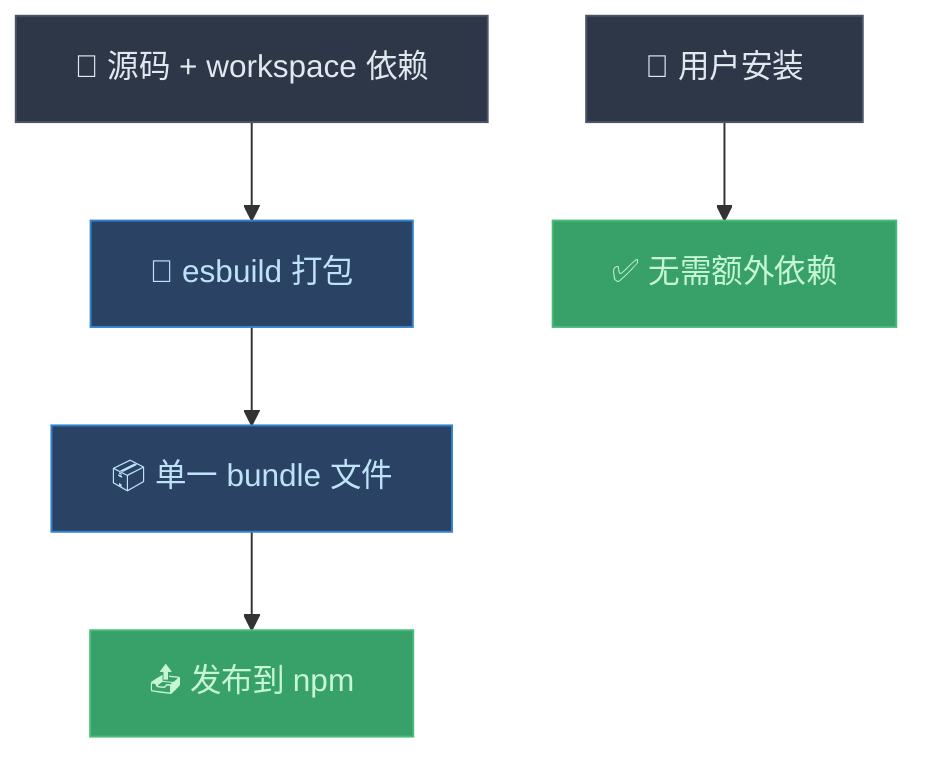
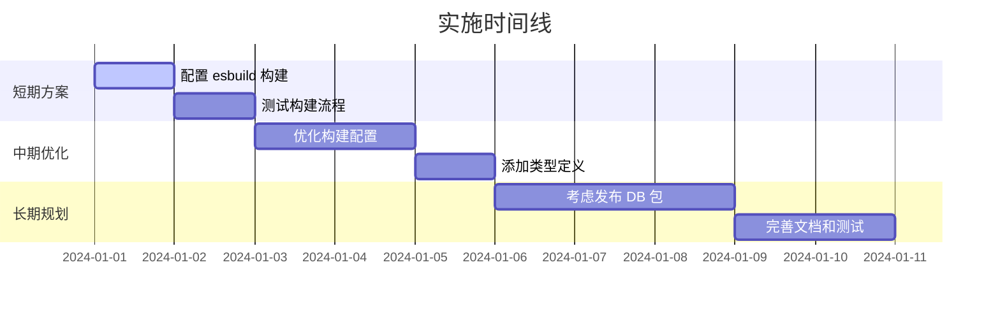

# Monorepo 中 MCP 服务器依赖管理解决方案

## 问题描述

在 monorepo 架构中，你的 `mcp-server` 包依赖了 `@downzoo/db` 包，但当你尝试发布 `mcp-server` 到 npm 时，用户安装时会遇到以下错误：

```
npm error 404 Not Found - GET https://registry.npmjs.org/@downzoo%2fdb - Not found
npm error 404 '@downzoo/db@^1.0.0' is not in this registry.
```

这是因为 `@downzoo/db` 包在 `package.json` 中被标记为 `"private": true`，无法发布到 npm registry。

## 当前架构分析

```mermaid
graph TD
    A["🏠 Monorepo Root"] --> B["📦 packages/db"]
    A --> C["📦 packages/mcp-server"]
    A --> D["🌐 apps/web"]
    
    C --> B
    D --> B
    
    E["📡 npm registry"] -.-> C
    E -.x B
    
    style A fill:#2d3748,stroke:#4a5568,color:#e2e8f0
    style B fill:#742a2a,stroke:#c53030,color:#fed7d7
    style C fill:#2a4365,stroke:#3182ce,color:#bee3f8
    style D fill:#2d3748,stroke:#4a5568,color:#e2e8f0
    style E fill:#2a4365,stroke:#3182ce,color:#bee3f8
```

## 解决方案对比

| 方案 | 优点 | 缺点 | 适用场景 |
|------|------|------|----------|
| 🚀 发布 DB 包 | 保持架构清晰，复用性好 | 需要维护额外的包，版本管理复杂 | DB 包有独立价值，多项目复用 |
| 📦 代码集成 | 部署简单，无外部依赖 | 代码重复，维护困难 | MCP 服务器是独立产品 |
| 🎯 Bundling | 保持开发体验，部署简单 | 构建复杂度增加 | 推荐方案 |
| 🔗 Git 依赖 | 快速解决，保持私有 | 安装慢，版本管理困难 | 临时解决方案 |

## 方案一：发布 @downzoo/db 包到 npm

### 实施步骤

1. **修改 db 包配置**

```json
// packages/db/package.json
{
  "name": "@downzoo/db",
  "version": "1.0.0",
  "private": false,  // 移除 private 标记
  "main": "dist/index.js",
  "types": "dist/index.d.ts",
  "files": [
    "dist",
    "prisma",
    "README.md"
  ],
  "publishConfig": {
    "access": "public",
    "registry": "https://registry.npmjs.org/"
  }
}
```

2. **添加构建和发布脚本**

```json
// packages/db/package.json - scripts 部分
{
  "scripts": {
    "build": "tsc -p tsconfig.json",
    "prepublishOnly": "pnpm run build",
    "prisma:generate": "prisma generate",
    "prisma:migrate": "prisma migrate deploy"
  }
}
```

3. **创建入口文件**

```typescript
// packages/db/src/index.ts
export * from '@prisma/client';
export { PrismaClient } from '@prisma/client';

// 导出你的数据库相关工具函数
export * from './utils';
export * from './types';
```

4. **发布包**

```bash
cd packages/db
pnpm build
npm publish
```

### 优缺点分析

**优点：**
- ✅ 保持 monorepo 架构清晰
- ✅ 其他项目可以复用 DB 包
- ✅ 版本管理规范
- ✅ 符合开源最佳实践

**缺点：**
- ❌ 需要维护额外的 npm 包
- ❌ 版本同步复杂
- ❌ 发布流程增加

## 方案二：将 DB 代码集成到 MCP Server

### 实施步骤

1. **复制 DB 代码**

```bash
# 将 db 包的源码复制到 mcp-server
cp -r packages/db/src/* packages/mcp-server/src/db/
cp -r packages/db/prisma packages/mcp-server/
```

2. **修改 mcp-server 的 package.json**

```json
// packages/mcp-server/package.json
{
  "dependencies": {
    "@modelcontextprotocol/sdk": "^1.17.4",
    // 移除 "@downzoo/db": "^1.0.0",
    "@prisma/client": "^6.15.0",
    "dotenv": "^17.2.2",
    "pg": "^8.16.3",
    "zod": "3"
  },
  "devDependencies": {
    "@types/node": "^24.3.0",
    "@types/pg": "^8.11.10",
    "prisma": "^6.15.0",  // 添加 prisma CLI
    "typescript": "^5.9.2"
  }
}
```

3. **更新导入路径**

```typescript
// packages/mcp-server/src/index.ts
// 从
import { PrismaClient } from '@downzoo/db';

// 改为
import { PrismaClient } from './db';
```

4. **添加 Prisma 脚本**

```json
// packages/mcp-server/package.json - scripts 部分
{
  "scripts": {
    "build": "prisma generate && tsc && chmod 755 build/index.js",
    "prisma:generate": "prisma generate",
    "prisma:migrate": "prisma migrate deploy"
  }
}
```

### 优缺点分析

**优点：**
- ✅ 部署简单，无外部依赖
- ✅ 用户安装即可使用
- ✅ 版本管理简单

**缺点：**
- ❌ 代码重复，违反 DRY 原则
- ❌ 维护困难，需要同步更新
- ❌ 包体积增大

## 方案三：使用 Bundling（推荐）

### 实施步骤

1. **安装构建工具**

```bash
cd packages/mcp-server
pnpm add -D esbuild @types/node
```

2. **创建构建脚本**

```javascript
// packages/mcp-server/scripts/build.js
import { build } from 'esbuild';
import { readFileSync } from 'fs';

const packageJson = JSON.parse(readFileSync('./package.json', 'utf8'));

const external = [
  // 保留这些作为外部依赖
  '@modelcontextprotocol/sdk',
  'dotenv',
  'pg',
  'zod'
];

await build({
  entryPoints: ['src/index.ts'],
  bundle: true,
  platform: 'node',
  target: 'node18',
  format: 'esm',
  outfile: 'build/index.js',
  external,
  banner: {
    js: '#!/usr/bin/env node'
  },
  define: {
    'process.env.NODE_ENV': '"production"'
  }
});

console.log('✅ Build completed');
```

3. **修改 package.json**

```json
// packages/mcp-server/package.json
{
  "scripts": {
    "build": "node scripts/build.js && chmod 755 build/index.js",
    "build:types": "tsc --emitDeclarationOnly",
    "prepublishOnly": "pnpm run build && pnpm run build:types"
  },
  "dependencies": {
    "@modelcontextprotocol/sdk": "^1.17.4",
    // 移除 "@downzoo/db": "^1.0.0",
    "dotenv": "^17.2.2",
    "pg": "^8.16.3",
    "zod": "3"
  },
  "devDependencies": {
    "@downzoo/db": "workspace:*",  // 开发时使用 workspace 依赖
    "@prisma/client": "^6.15.0",
    "@types/node": "^24.3.0",
    "@types/pg": "^8.11.10",
    "esbuild": "^0.19.0",
    "typescript": "^5.9.2"
  }
}
```

4. **更新 TypeScript 配置**

```json
// packages/mcp-server/tsconfig.json
{
  "compilerOptions": {
    "target": "ES2022",
    "module": "ESNext",
    "moduleResolution": "node",
    "declaration": true,
    "emitDeclarationOnly": true,
    "outDir": "build",
    "rootDir": "src",
    "strict": true,
    "esModuleInterop": true,
    "skipLibCheck": true,
    "forceConsistentCasingInFileNames": true
  },
  "include": ["src/**/*"],
  "exclude": ["build", "node_modules"]
}
```

### 构建流程图



### 优缺点分析

**优点：**
- ✅ 保持开发时的 monorepo 体验
- ✅ 发布时无外部依赖
- ✅ 用户安装简单
- ✅ 代码不重复

**缺点：**
- ❌ 构建配置复杂
- ❌ 调试稍微困难
- ❌ 包体积可能较大

## 方案四：使用 Git 依赖（临时方案）

### 实施步骤

1. **发布 DB 包到 Git**

首先确保 `@downzoo/db` 包已经构建并推送到 Git 仓库。

2. **修改 mcp-server 的依赖**

```json
// packages/mcp-server/package.json
{
  "dependencies": {
    "@modelcontextprotocol/sdk": "^1.17.4",
    "@downzoo/db": "github:zhujianye/ai-collaboration-archive#main:packages/db",
    "@prisma/client": "^6.15.0",
    "dotenv": "^17.2.2",
    "pg": "^8.16.3",
    "zod": "3"
  }
}
```

### 优缺点分析

**优点：**
- ✅ 快速解决问题
- ✅ 保持代码私有
- ✅ 无需额外配置

**缺点：**
- ❌ 安装速度慢
- ❌ 版本管理困难
- ❌ 用户体验差
- ❌ 不适合生产环境

## 推荐实施方案

基于你的需求分析，我推荐使用 **方案三：Bundling**，原因如下：

1. **保持开发体验**：在 monorepo 中继续使用 workspace 依赖
2. **简化用户安装**：发布的包无外部依赖
3. **代码不重复**：避免维护多份相同代码
4. **灵活性高**：可以选择性地 bundle 依赖

### 实施优先级



## 总结

选择哪种方案取决于你的具体需求：

- 如果 `@downzoo/db` 有独立价值且会被多个项目使用 → **方案一**
- 如果 MCP 服务器是独立产品且不需要复用 DB 代码 → **方案二**
- 如果想保持 monorepo 开发体验但简化部署 → **方案三**（推荐）
- 如果需要快速解决问题 → **方案四**（临时）

建议先使用方案三快速解决问题，然后根据项目发展情况考虑是否需要调整为方案一。