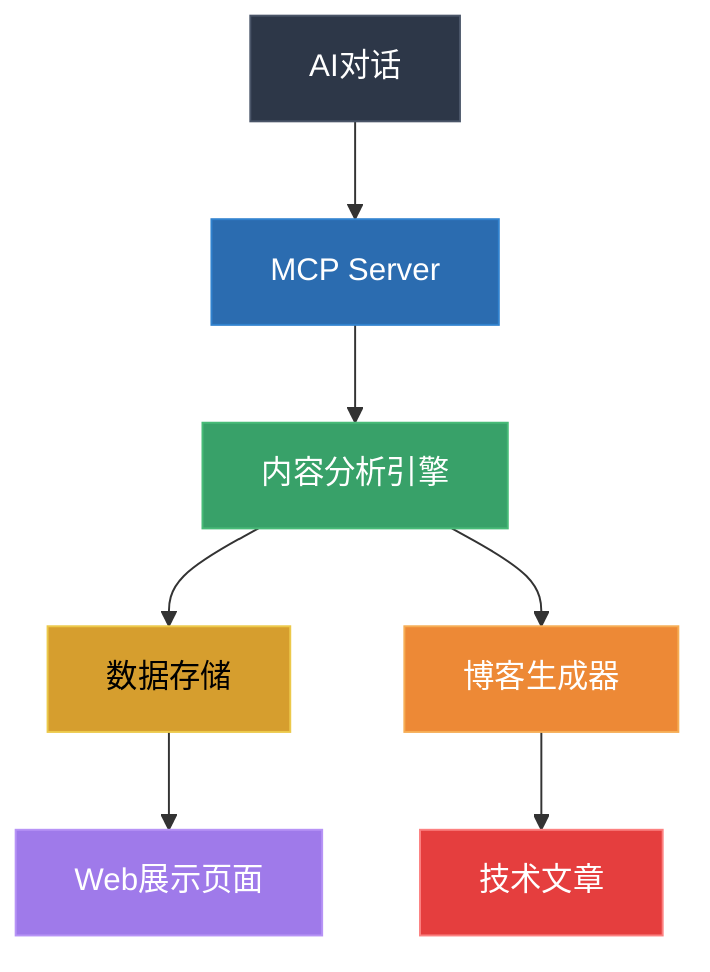
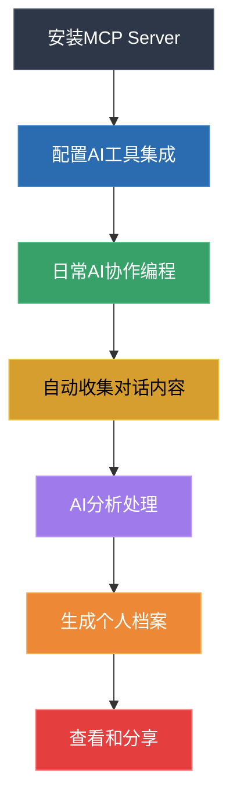

# AI协作档案生成器 - 产品需求文档 (PRD)

## 1. 产品概述

### 1.1 一句话描述
温和的、主动的记录我们与 AI 日常的思考，解决的问题

### 1.2 产品愿景
让程序员与AI协作的过程变得有价值、可记录、可展示，将日常编程中的问题解决过程转化为职业发展的资产。

### 1.3 目标用户
- 日常使用AI工具（GPT、Copilot、通义灵码等）进行编程的开发者
- 希望更好地展示自己技术能力和问题解决能力的程序员
- 需要维护技术简历和作品集的开发者

## 2. 问题分析

### 2.1 核心痛点

#### 痛点1：不会写简历
**问题描述**：许多程序员不知道怎么写简历才能体现自己的技术，明明自己平时解决了许多问题，积累了许多经验，但却无法直观的表达出来。

**解决方案**：AI 通过 MCP 自动生成页面（解决的 bug、技术栈、业务）

#### 痛点2：没时间维护简历
**问题描述**：工作忙，没时间维护简历，没法及时的把自己的思考、成果、作品、经验体现出来。往往都是到了要被裁员了才想起来更新下简历。

**解决方案**：安装一个 MCP 工具，自动收集平时和 AI 聊天的内容，然后把用户解决了的问题收集起来，做成一个个人解决了什么问题的展示页，这个页面会随着你解决问题的数量的增多，不断更新。

#### 痛点3：没时间积累技术上的影响力
**问题描述**：工作忙，下班回家后还有自己的生活，平时学习的场景主要发生在公司里，因此很难坚持写博客、做技术思考、写分享文章。

**解决方案**：记录如何让 AI 解决问题的思路。比如记录下来如何一步步引导 AI 修复问题、完成业务，平时用 AI 主要做什么。

### 2.2 需求验证

基于Reddit社区的反馈和讨论，我们发现：

1. **真实需求存在**：多位开发者表达了类似困扰
   - "那些对话感觉像是我的实际解决问题能力的金矿，但它们只是消失在历史中"
   - "在我最需要它们的时候（比如裁员迫在眉睫时），我从来没有时间和精力手动整理"

2. **市场机会**：
   - 可以作为其他产品的引流工具
   - 解决了开发者的真实痛点
   - 符合AI时代的工作方式变化

## 3. 产品功能

### 3.1 核心功能

#### 3.1.1 MCP Server集成
- 通过MCP协议自动收集AI对话内容
- 支持多种AI工具（GPT、Copilot、通义灵码等）
- 实时数据同步和处理

#### 3.1.2 智能内容分析
- **技术栈识别**：自动识别对话中涉及的编程语言、框架、工具
- **问题分类**：将解决的问题按类型分类（Bug修复、功能开发、性能优化等）
- **业务场景提取**：识别具体的业务场景和应用领域
- **标签生成**：自动生成相关技术标签

#### 3.1.3 个人档案生成
- **技术能力展示页**：展示掌握的技术栈和熟练程度
- **问题解决档案**：按时间线展示解决的具体问题
- **成长轨迹**：可视化技术成长过程
- **博客文章生成**：基于对话内容自动生成技术博客

### 3.2 产品形态

#### 3.2.1 技术架构

#### 3.2.2 用户界面
- **个人主页**：展示技术概览和最新动态
- **项目档案**：按项目维度展示解决的问题
- **技能图谱**：可视化技术栈和熟练度
- **时间线视图**：按时间展示技术成长轨迹

## 4. 使用流程

### 4.1 用户使用流程

### 4.2 详细步骤
1. **安装配置**：用户安装MCP Server并配置AI工具集成
2. **日常使用**：正常进行AI协作编程，无需额外操作
3. **自动收集**：系统自动收集有价值的对话内容
4. **智能分析**：AI分析技术栈、问题类型、解决方案
5. **档案生成**：自动生成个人技术档案和展示页面
6. **持续更新**：随着新的问题解决，档案持续更新

## 5. 竞争分析

### 5.1 与传统简历的区别

| 维度 | 传统简历 | AI协作档案 |
|------|----------|------------|
| 内容来源 | 手动整理 | 自动收集 |
| 更新频率 | 被动更新 | 实时更新 |
| 展示维度 | 静态描述 | 动态过程 |
| 真实性 | 主观描述 | 客观记录 |
| 维护成本 | 高 | 低 |

### 5.2 核心价值主张
- **真实性**：基于实际工作过程的客观记录
- **时效性**：实时更新，反映最新能力状态
- **完整性**：全面记录技术成长轨迹
- **便利性**：自动化处理，无需手动维护

## 6. 技术实现

### 6.1 技术栈
- **后端**：Node.js + TypeScript
- **MCP协议**：用于AI工具集成
- **AI分析**：DeepSeek API / OpenAI API
- **数据存储**：SQLite / PostgreSQL
- **前端**：React + Next.js + TailwindCSS

### 6.2 核心模块
1. **MCP Server模块**：处理AI对话数据收集
2. **内容分析模块**：AI驱动的内容理解和分类
3. **档案生成模块**：自动生成个人技术档案
4. **Web展示模块**：用户界面和数据展示

## 7. 商业模式

### 7.1 盈利模式
- **免费版**：基础功能，有限的存储和分析
- **专业版**：高级分析、无限存储、自定义模板
- **企业版**：团队协作、数据分析、API接入

### 7.2 增长策略
- **产品驱动增长**：解决真实痛点，用户自然传播
- **社区营销**：在开发者社区分享和讨论
- **内容营销**：通过生成的技术文章吸引用户
- **合作伙伴**：与AI工具厂商合作集成

## 8. 风险与挑战

### 8.1 主要风险
1. **隐私安全**：用户对代码和对话内容的隐私担忧
2. **数据质量**：AI分析结果的准确性和相关性
3. **用户习惯**：改变用户现有的工作流程
4. **技术依赖**：依赖第三方AI服务的稳定性

### 8.2 应对策略
1. **隐私保护**：本地处理、数据加密、用户控制
2. **质量保证**：持续优化AI模型、用户反馈机制
3. **渐进式集成**：最小化对现有工作流程的影响
4. **多元化支持**：支持多种AI服务，降低单点依赖

## 9. 发展路线图

### 9.1 MVP阶段（2周）
- 基础MCP Server实现
- 简单的内容分析功能
- 基础的Web展示页面

### 9.2 Beta阶段（1个月）
- 完善AI分析能力
- 优化用户界面
- 收集用户反馈

### 9.3 正式版（3个月）
- 多AI工具支持
- 高级分析功能
- 商业化功能

## 10. 成功指标

### 10.1 产品指标
- 用户注册数和活跃度
- 对话内容收集量
- 档案生成质量评分
- 用户留存率

### 10.2 业务指标
- 付费转化率
- 用户生命周期价值
- 口碑传播系数
- 合作伙伴数量

---

**文档版本**：v1.0  
**创建日期**：2024年12月  
**最后更新**：2024年12月  
**负责人**：产品团队