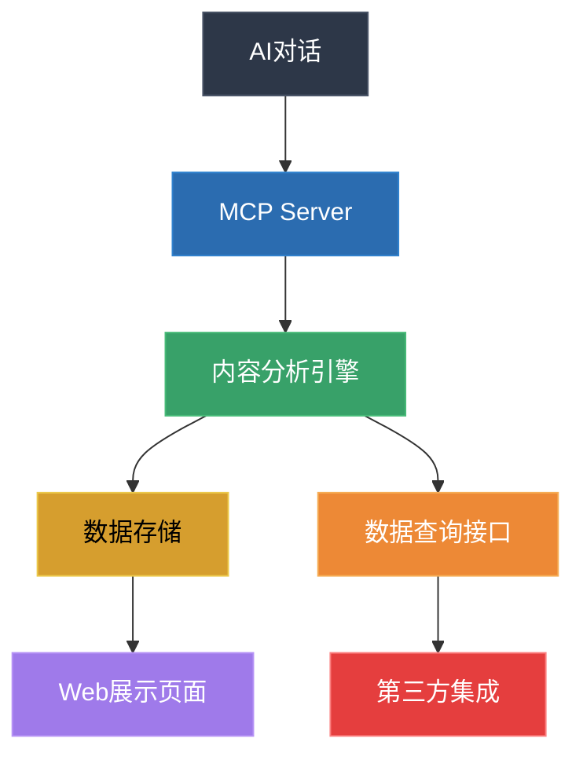
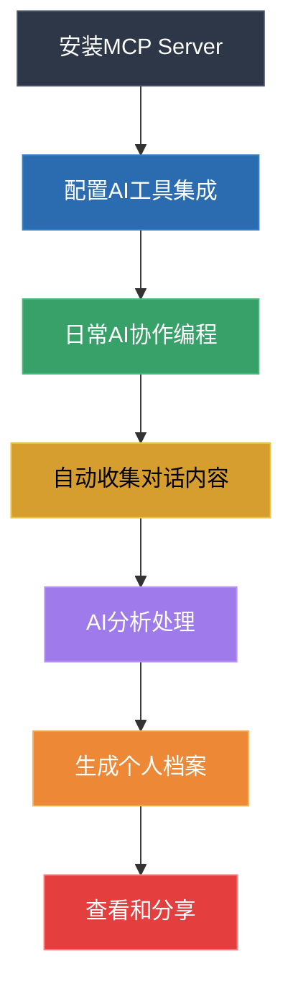
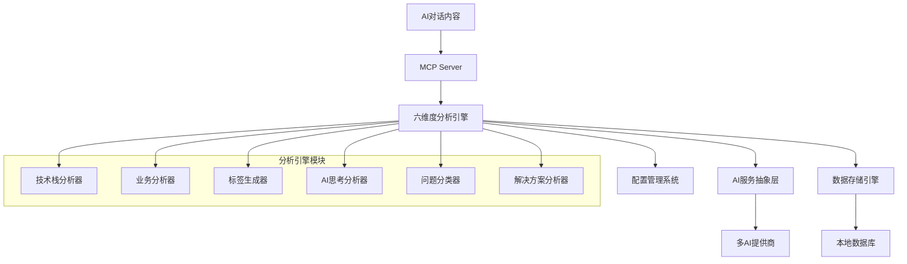

# 从AI聊天中提炼记录有价值的内容 - 产品需求文档 (PRD)

## 1. 产品概述

### 1.1 一句话描述

温和的、主动的记录我们与 AI 日常的思考，解决的问题

### 1.2 产品愿景

让程序员与AI协作的过程变得有价值、可记录、可展示，将日常编程中的问题解决过程转化为职业发展的资产。

### 1.3 目标用户

* 日常使用AI工具（GPT、Copilot、通义灵码等）进行编程的开发者

* 希望更好地展示自己技术能力和问题解决能力的程序员

* 需要维护技术简历和作品集的开发者

## 2. 问题分析

### 2.1 核心痛点

#### 痛点1：不会写简历

**问题描述**：许多程序员不知道怎么写简历才能体现自己的技术，明明自己平时解决了许多问题，积累了许多经验，但却无法直观的表达出来。

**解决方案**：AI 通过 MCP 自动生成页面（解决的 bug、技术栈、业务）

#### 痛点2：没时间维护简历

**问题描述**：工作忙，没时间维护简历，没法及时的把自己的思考、成果、作品、经验体现出来。往往都是到了要被裁员了才想起来更新下简历。

**解决方案**：安装一个 MCP 工具，自动收集平时和 AI 聊天的内容，然后把用户解决了的问题收集起来，做成一个个人解决了什么问题的展示页，这个页面会随着你解决问题的数量的增多，不断更新。

#### 痛点3：没时间积累技术上的影响力

**问题描述**：工作忙，下班回家后还有自己的生活，平时学习的场景主要发生在公司里，因此很难坚持写博客、做技术思考、写分享文章。

**解决方案**：记录如何让 AI 解决问题的思路。比如记录下来如何一步步引导 AI 修复问题、完成业务，平时用 AI 主要做什么。

### 2.2 需求验证

基于Reddit社区的反馈和讨论，我们发现：

1. **真实需求存在**：多位开发者表达了类似困扰

   * "那些对话感觉像是我的实际解决问题能力的金矿，但它们只是消失在历史中"

   * "在我最需要它们的时候（比如裁员迫在眉睫时），我从来没有时间和精力手动整理"

2. **市场机会**：

   * 可以作为其他产品的引流工具

   * 解决了开发者的真实痛点

   * 符合AI时代的工作方式变化

## 3. 产品功能

### 3.1 核心功能（已实现）

#### 3.1.1 MCP Server集成

* ✅ 通过MCP协议自动收集AI对话内容

* ✅ 支持多种AI提供商（DeepSeek、OpenAI、Claude、自定义API）

* ✅ 实时数据处理和分析

* ✅ 完整的MCP工具集（5个核心工具）

#### 3.1.2 六维度智能分析系统

* ✅ **技术栈分析**：识别12种技术栈类型（前端、后端、移动端、DevOps、数据库、AI/ML、区块链、游戏开发、嵌入式、测试、设计、其他）

* ✅ **业务分析**：覆盖13个业务领域（电商、金融科技、医疗健康、教育、娱乐、社交媒体、生产力工具、游戏、物联网、企业级、创业、开源、其他）

* ✅ **智能标签**：自动生成5种标签类型（技术、业务、流程、质量、通用）

* ✅ **AI思考分析**：提取对话中的思考过程和关键问题

* ✅ **问题分类**：识别12种问题类型（Bug修复、功能需求、性能优化、安全问题、文档问题、配置问题、集成问题、测试问题、部署问题、架构问题、代码审查、其他）

* ✅ **解决方案总结**：提取解决方案和最佳实践

#### 3.1.3 数据分析与存储

* ✅ **数据结构化存储**：将分析结果以结构化格式存储

* ✅ **统计信息**：各维度的量化统计数据

* ✅ **数据查询接口**：支持按技术栈、业务领域等维度查询

* 🔄 **Web展示页面**：个人技术档案的Web界面（规划中）

* 🔄 **数据导出功能**：支持多种格式的数据导出（规划中）

### 3.2 产品形态

#### 3.2.1 技术架构

#### 3.2.2 用户界面

* **个人主页**：展示技术概览和最新动态

* **项目档案**：按项目维度展示解决的问题

* **技能图谱**：可视化技术栈和熟练度

* **时间线视图**：按时间展示技术成长轨迹

## 4. 使用流程

### 4.1 用户使用流程

### 4.2 详细步骤

1. **安装配置**：用户安装MCP Server并配置AI工具集成
2. **日常使用**：正常进行AI协作编程，无需额外操作
3. **自动收集**：系统自动收集有价值的对话内容
4. **智能分析**：AI分析技术栈、问题类型、解决方案
5. **数据存储**：自动存储个人技术分析数据
6. **持续更新**：随着新的问题解决，档案持续更新

## 5. 竞争分析

### 5.1 与传统简历的区别

| 维度   | 传统简历 | AI协作档案 |
| ---- | ---- | ------ |
| 内容来源 | 手动整理 | 自动收集   |
| 更新频率 | 被动更新 | 实时更新   |
| 展示维度 | 静态描述 | 动态过程   |
| 真实性  | 主观描述 | 客观记录   |
| 维护成本 | 高    | 低      |

### 5.2 核心价值主张

* **真实性**：基于实际工作过程的客观记录

* **时效性**：实时更新，反映最新能力状态

* **完整性**：全面记录技术成长轨迹

* **便利性**：自动化处理，无需手动维护

## 6. 技术实现

### 6.1 整体架构（已实现）

### 6.2 技术栈（当前实现）

#### 6.2.1 后端技术

* ✅ **Node.js + TypeScript**：主要开发语言，完整类型安全

* ✅ **MCP协议**：标准化AI工具通信协议

* ✅ **模块化架构**：6个核心模块，支持独立扩展

* ✅ **多AI提供商**：DeepSeek、OpenAI、Claude、自定义API

* ✅ **本地数据存储**：JSON配置文件，结构化数据存储

#### 6.2.2 核心模块（已实现）

* ✅ **types.ts**：统一类型定义和接口

* ✅ **config.ts**：配置管理，支持热更新

* ✅ **ai-service.ts**：AI服务抽象层

* ✅ **analyzers.ts**：六维度分析器集合

* ✅ **database.ts**：数据存储管理器

* ✅ **index.ts**：MCP服务器主入口

#### 6.2.3 规划中的技术

* 🔄 **React + TypeScript**：Web界面开发

* 🔄 **TailwindCSS**：样式框架

* 🔄 **Chart.js/Recharts**：数据可视化

* 🔄 **数据库**：SQLite/PostgreSQL（持久化存储）

* 🔄 **Docker**：容器化部署

## 7. 商业模式

### 7.1 盈利模式

* **免费版**：基础功能，有限的存储和分析

* **专业版**：高级分析、无限存储、自定义模板

* **企业版**：团队协作、数据分析、API接入

### 7.2 增长策略

* **产品驱动增长**：解决真实痛点，用户自然传播

* **社区营销**：在开发者社区分享和讨论

* **内容营销**：通过技术分析数据吸引用户

* **合作伙伴**：与AI工具厂商合作集成

## 8. 开发计划

### 8.1 第一阶段（MVP - 已完成 ✅）

* ✅ MCP Server基础框架搭建

* ✅ 六维度分析系统实现

* ✅ 智能数据存储功能

* ✅ 本地文件存储和配置管理

* ✅ 多AI提供商支持

* ✅ 模块化架构设计

### 8.2 第二阶段（Beta - 进行中 🔄）

* ✅ 完善分析算法（六维度分析）

* ✅ 配置系统和热更新

* ✅ 错误容错和并行处理

* 🔄 Web界面开发（规划中）

* 🔄 数据可视化增强

* 🔄 用户系统设计

### 8.3 第三阶段（正式版 - 规划中 📋）

* 📋 性能优化和缓存机制

* 📋 多语言支持

* 📋 高级分析功能（趋势分析、技能评估）

* 📋 团队协作功能

* 📋 数据持久化存储

* 📋 API接口开放

### 8.4 当前项目状态

**项目阶段**: Beta阶段\
**完成度**: 约70%\
**核心功能**: 已完全实现\
**下一步重点**: Web界面开发和数据可视化

## 9. 风险与挑战

### 9.1 主要风险

1. **隐私安全**：用户对代码和对话内容的隐私担忧
2. **数据质量**：AI分析结果的准确性和相关性
3. **用户习惯**：改变用户现有的工作流程
4. **技术依赖**：依赖第三方AI服务的稳定性

### 9.2 应对策略

1. **隐私保护**：本地处理、数据加密、用户控制
2. **质量保证**：持续优化AI模型、用户反馈机制
3. **渐进式集成**：最小化对现有工作流程的影响
4. **多元化支持**：支持多种AI服务，降低单点依赖

## 10. 发展路线图

### 10.1 MVP阶段（已完成 ✅）

* ✅ 基础MCP Server实现

* ✅ 六维度数据分析功能

* ✅ 智能数据存储系统

* ✅ 多AI提供商支持

### 10.2 Beta阶段（进行中 🔄）

* ✅ 完善AI分析能力

* 🔄 Web展示界面开发

* 🔄 用户体验优化

* 🔄 收集用户反馈

### 10.3 正式版（规划中 📋）

* 📋 团队协作功能

* 📋 高级分析和趋势预测

* 📋 商业化功能和付费模式

* 📋 API开放和生态建设

## 11. 成功指标

### 11.1 产品指标

#### 已达成指标 ✅

* ✅ **核心功能完整性**：六维度分析系统100%实现

* ✅ **技术栈覆盖度**：支持12种主流技术栈类型

* ✅ **业务领域覆盖**：支持13个主要业务领域

* ✅ **AI提供商支持**：支持4种主流AI服务

* ✅ **模块化程度**：6个核心模块完全解耦

#### 目标指标 📋

* 📋 **用户注册数**：首月100+，半年1000+

* 📋 **活跃用户数**：月活跃用户50%+

* 📋 **数据分析数**：每用户平均分析5+次对话

* 📋 **用户留存率**：30天留存率60%+

### 11.2 技术指标

#### 已达成指标 ✅

* ✅ **分析维度完整性**：6个分析维度全覆盖

* ✅ **配置灵活性**：支持运行时热更新配置

* ✅ **错误容错性**：单模块失败不影响整体

* ✅ **并行处理**：多分析器同时执行

* ✅ **类型安全**：100% TypeScript类型覆盖

#### 目标指标 📋

* 📋 **分析准确率**：技术栈识别准确率90%+

* 📋 **响应时间**：分析响应时间<5秒

* 📋 **系统稳定性**：99.5%+可用性

* 📋 **数据处理量**：支持10万+对话分析

### 11.3 商业指标（规划中）

* 📋 **付费转化率**：免费用户转付费5%+

* 📋 **客户获取成本**：<$50

* 📋 **客户生命周期价值**：>$200

* 📋 **收入增长**：月收入增长20%+

### 11.4 当前项目成就

* 🏆 **MVP完全实现**：核心功能100%完成

* 🏆 **架构设计优秀**：模块化、可扩展、类型安全

* 🏆 **技术栈先进**：MCP协议、多AI支持、热更新

* 🏆 **用户体验良好**：智能分析、数据存储、配置灵活

***

## 📋 文档更新记录

### 最新更新（2024年12月）

本次更新反映了AI协作档案分析器项目的重大进展：

#### 🎯 核心成就

* ✅ **六维度分析系统**：完全实现技术栈、业务、标签、AI思考、问题分类、解决方案六个维度的智能分析

* ✅ **模块化架构**：采用完全解耦的模块化设计，包含6个核心模块

* ✅ **多AI提供商支持**：支持DeepSeek、OpenAI、Claude、自定义API

* ✅ **配置管理系统**：支持运行时热更新，无需重启服务

* ✅ **MCP工具集**：提供5个核心工具，完整的AI协作数据分析能力

#### 🔧 技术实现

* **技术栈覆盖**：12种主流技术栈类型识别

* **业务领域**：13个主要业务领域分析

* **智能标签**：5种标签类型自动生成

* **问题分类**：12种问题类型精准识别

* **并行处理**：多分析器同时执行，提升效率

* **错误容错**：单模块失败不影响整体系统

#### 📊 项目状态

* **开发阶段**：Beta阶段（约70%完成度）

* **核心功能**：已完全实现

* **下一步重点**：Web界面开发和数据可视化

#### 🚀 技术亮点

* **类型安全**：100% TypeScript覆盖

* **架构优秀**：模块化、可扩展、易维护

* **配置灵活**：支持自定义提示词和分析模块启用/禁用

* **数据完整**：支持六维度分析、统计信息、数据查询

***

**文档版本**：v1.0\
**创建日期**：2024年12月\
**最后更新**：2024年12月\
**负责人**：产品团队
