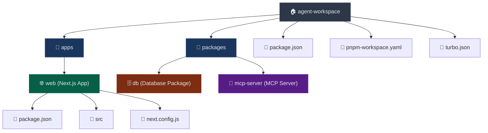

# 项目结构重构总结

## 重构目标
将项目从传统的 packages 结构重构为现代的 monorepo 结构，使用 apps 目录来组织应用程序。

## 重构步骤

### 1. 创建 apps 目录
```bash
mkdir -p apps
```

### 2. 移动 web 应用
```bash
mv packages/web apps/web
```

### 3. 更新工作区配置

#### pnpm-workspace.yaml
```yaml
packages:
  - "packages/*"
  - "apps/*"  # 新增
```

#### package.json
```json
{
  "workspaces": [
    "packages/*",
    "apps/*"  // 新增
  ]
}
```

## 重构后的目录结构



## 重构优势

### 1. 清晰的应用分离
- **apps/**: 存放可部署的应用程序
- **packages/**: 存放共享的库和工具包

### 2. 符合现代 Monorepo 最佳实践
- 遵循 Nx、Lerna、Rush 等工具的约定
- 更好的可扩展性和维护性

### 3. Turbo 集成
- 现有的 turbo.json 配置无需修改
- 支持并行构建和缓存优化
- 统一的脚本管理

## 验证重构结果

### 1. 依赖解析正常
```bash
pnpm install  # ✅ 成功
```

### 2. 工作区识别正确
- apps/web 被正确识别为工作区包
- @downzoo/db 依赖引用正常工作

### 3. Turbo 脚本正常
```bash
pnpm run dev    # 启动所有开发服务器
pnpm run build  # 构建所有包
pnpm run lint   # 检查所有包
```

## 注意事项

1. **依赖引用**: workspace:* 引用自动适配新的目录结构
2. **TypeScript 配置**: 现有的 tsconfig.json 无需修改
3. **构建输出**: 保持原有的构建配置和输出路径
4. **部署配置**: 部署脚本可能需要更新路径引用

## 后续建议

1. **添加更多应用**: 未来可以在 apps/ 下添加更多应用
   - apps/admin (管理后台)
   - apps/mobile (移动端应用)
   - apps/docs (文档站点)

2. **优化 Turbo 配置**: 可以针对 apps 和 packages 设置不同的构建策略

3. **CI/CD 优化**: 利用 Turbo 的缓存机制优化构建流水线

## 总结

本次重构成功将项目从传统结构迁移到现代 monorepo 结构，保持了所有功能的完整性，同时提升了项目的可维护性和扩展性。Turbo 的集成确保了高效的构建和开发体验。